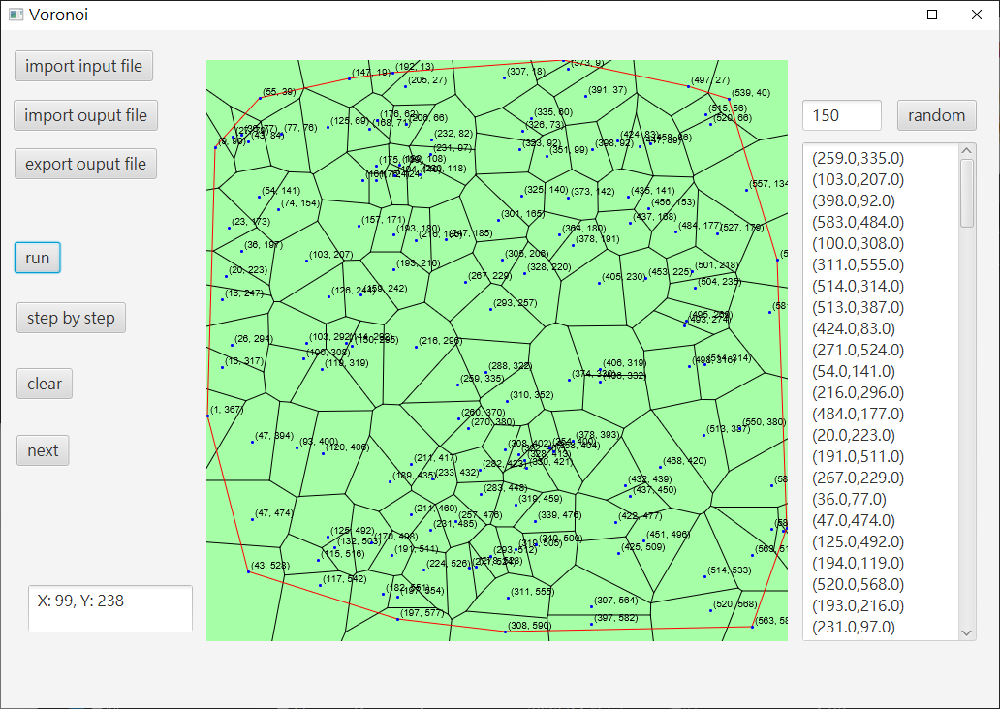

# VoronoiDiagram
voronoi diagram with JavaFx

## Algorithm
Divide and Conquer

### Divide
divide all generator points to a complete tree

### Merge

1. find upper tangent and lower tangent with Convex Hull algorithm
2. Iteratively find the mid-perpendicular line from upper tangent to lower tangent
    + delete vertex and edge right from intersection in left voronoi diagram
    + delete vertex and edge left from intersection in right voronoi diagram

### Convex Hull
divide and conquer

## Time Complexity
time complexity is O(n)

## Demo

##### 125 points

##### 130 points

##### 150 points
