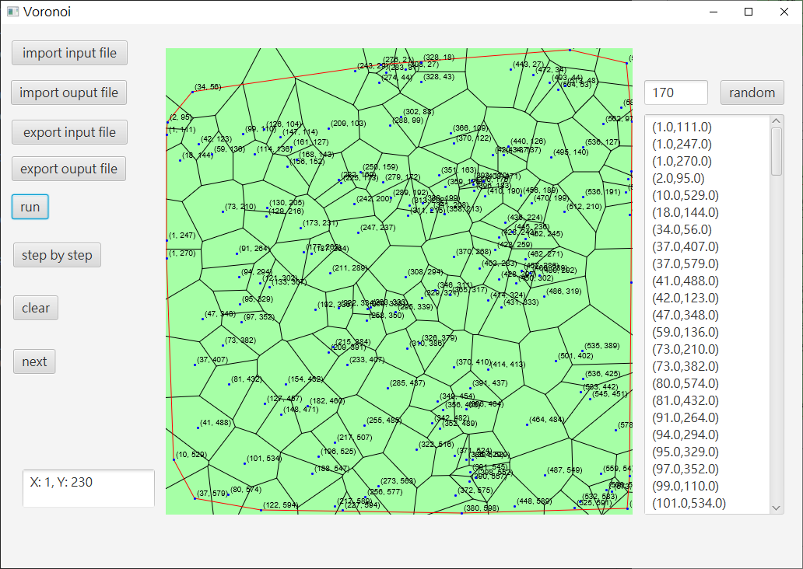

# VoronoiDiagram
voronoi diagram with JavaFx

## Execution Guide

1. Download [Latest Release](https://github.com/dockyu/VoronoiDiagram/releases/latest)
2. Extract the zip
3. Execute `VoronoiDiagram_<version>/bin/VoronoiDiagramApp.bat`

## Algorithm
Divide and Conquer

### Divide
divide all generator points to a complete tree

### Merge

1. find upper tangent and lower tangent with Convex Hull algorithm
2. Iteratively find the mid-perpendicular line from upper tangent to lower tangent
    + delete vertex and edge right from intersection in left voronoi diagram
    + delete vertex and edge left from intersection in right voronoi diagram

### Convex Hull
divide and conquer

## Time Complexity
time complexity is *O(log(n))*

## Demo

##### 150 points
`test/150_points.txt`

##### 170 points
`test/170_points.txt`
