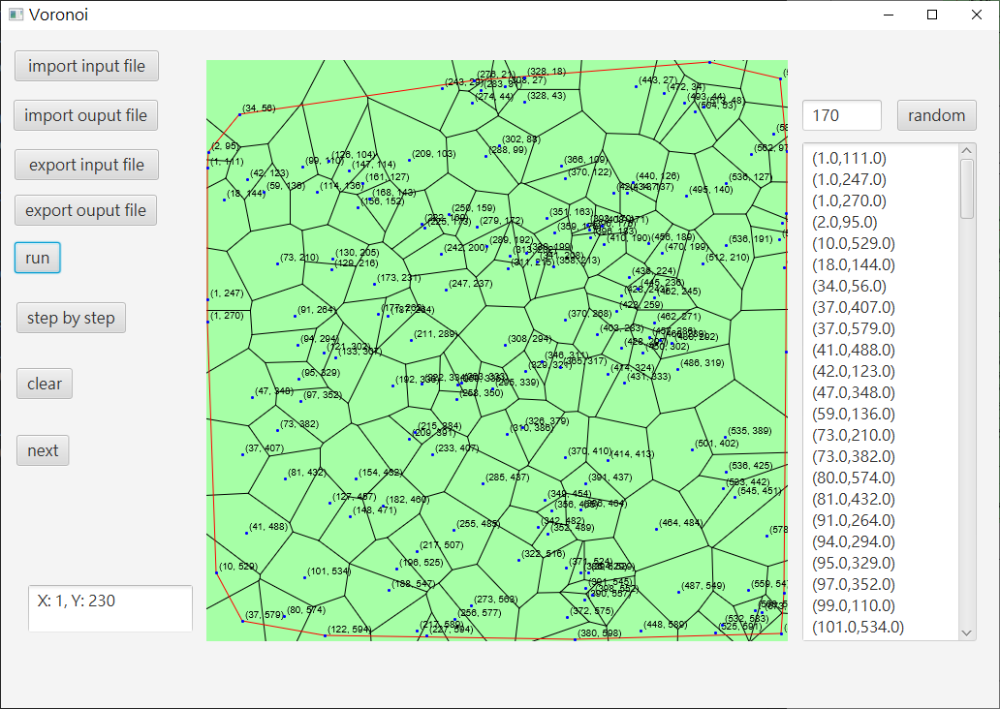
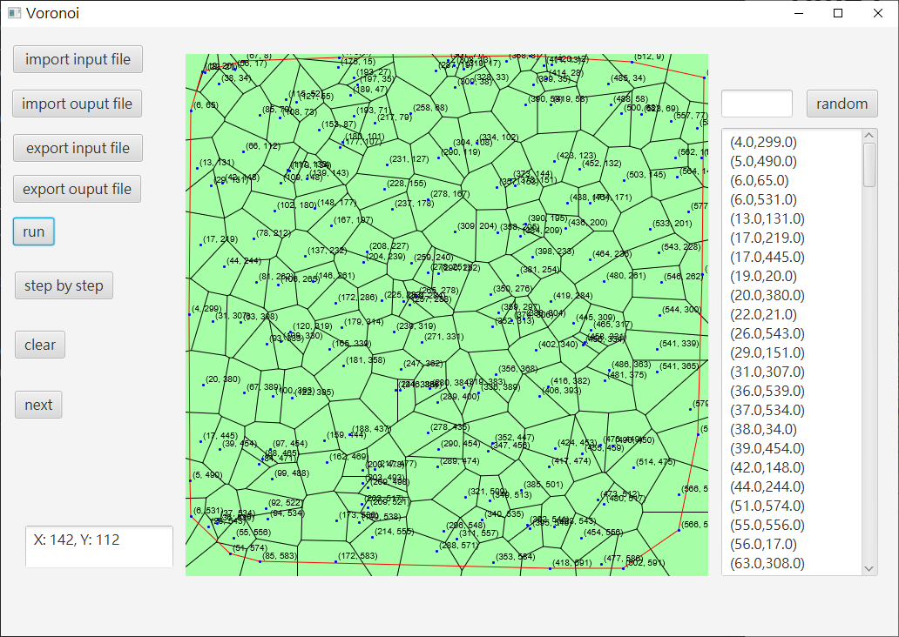

# VoronoiDiagram

繁體中文 | [English](../../README.md) | [Español](./README_ES.md)

使用JavaFx製作的Voronoi Diagram

## 執行指南

1. 下載 [最新版本](https://github.com/dockyu/VoronoiDiagram/releases/latest)
2. 解壓縮zip檔案
3. 執行 `VoronoiDiagram_<version>/bin/VoronoiDiagramApp.bat`

## 演算法
Divide and Conquer

### Divide
將所有生成點分成一個完整的樹

### Merge

1. 使用Convex Hull算法找到上切線和下切線
2. 逐步找到從上切線到下切線的中垂線
    + 刪除左Voronoi Diagram中交點右側的端點和邊
    + 刪除右Voronoi Diagram中交點左側的端點和邊

### Convex Hull
+ Divide and Conquer
+ 記錄Convex Hull中最右和最左的點
    + 將左圖最右點與右圖最左點連接作為臨時切線
    + 逐步使用臨時切線找到上切線和下切線

## 時間複雜度
時間複雜度為 **`O(nlog(n))`**

## 演示
|[170點](../../test/170_points.txt)|[205點](../../test/205_points.txt)|
|-|-|
|||
